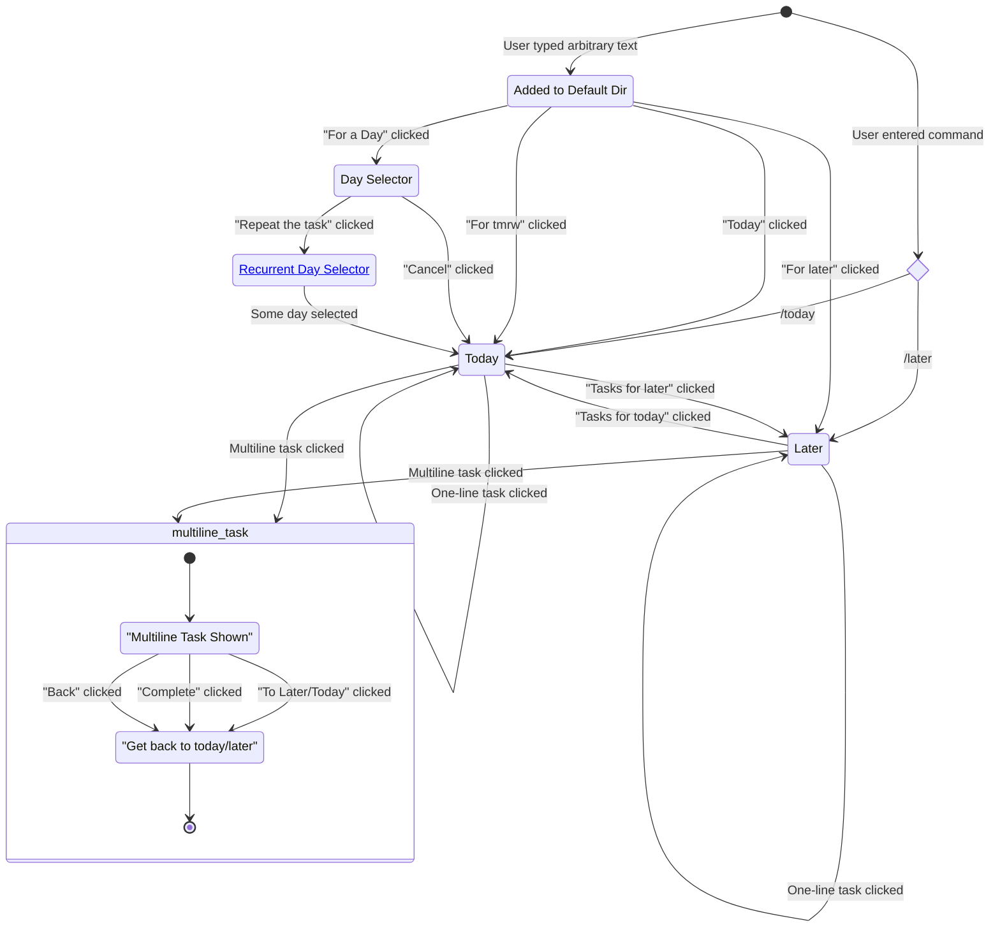

# Bot's State Machine

It's just a subset of the whole state machine

```mermaid
stateDiagram    
    added: Added to Default Dir
    daySelectorOnce: Day Selector
    daySelectorRecurrent: <a href="/zakirullin/stuff-bot/blob/main/docs/calendar.md">Recurrent Day Selector</a>
    today: Today 
    later: Later
    state cmdType <<choice>>

    [*] --> added : User typed arbitrary text
    [*] --> cmdType  : User entered command

    cmdType --> later : /later
    cmdType --> today : /today
    added --> daySelectorOnce : "For a Day" clicked
    added --> today : "Today" clicked
    added --> today : "For tmrw" clicked
    added --> later : "For later" clicked
    daySelectorOnce --> daySelectorRecurrent : "Repeat the task" clicked
    daySelectorOnce --> today : "Cancel" clicked
    daySelectorRecurrent --> today : Some day selected

    later --> today : "Tasks for today" clicked
    today --> later : "Tasks for later" clicked
    today --> today : One-line task clicked
    later --> later : One-line task clicked
    today  --> multiline_task : Multiline task clicked
    later --> multiline_task : Multiline task clicked

    state multiline_task {
        ml: "Multiline Task Shown"
        back: "Get back to today/later"
        [*] --> ml
        ml --> back : "Back" clicked
        ml --> back : "Complete" clicked
        ml --> back : "To Later/Today" clicked
        back --> [*]
    }
```